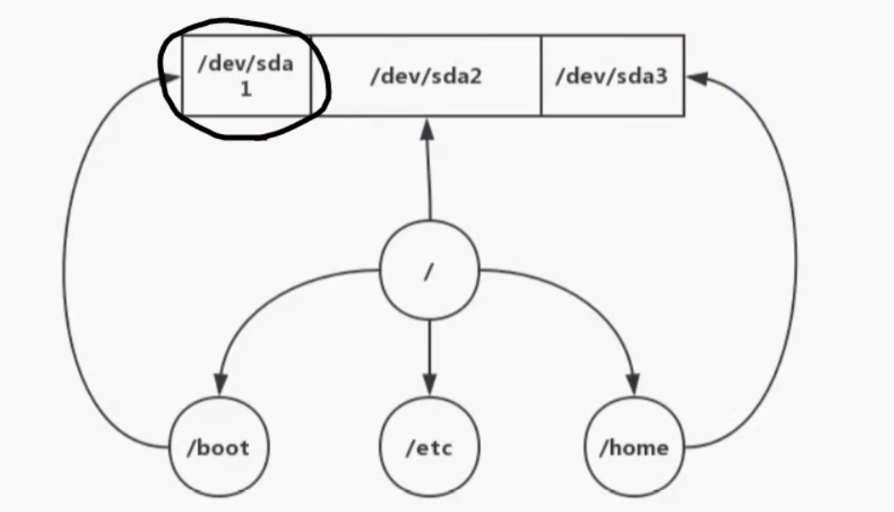

# Linux

## 1、Linux

### 1 介绍

- Linux 是一套免费使用和自由传播的类 Unix 操作系统
- 在服务器领域和嵌入式领域有非常广泛的应用

### 2 版本

- 分为内核版本和发行版本
- kernel
- 各个厂商会尝试制作自己的发行版本
  - redhat
  - CentOS
  - debian
  - ubuntu
  - fedora

### 3 Linux 和 Window 的不同

- Linux 严格区分大小写
- Linux 中所有的内容以文件形式保存，包括硬件、用户和文件。
- Linux 不靠扩展名区分文件类型，是靠权限来区分，但是有一些约定的扩展名，是给管理员看的
  - 压缩包 `.gz` `.bz2` `.tar.bz2` `.tgz`
  - 二进制文件 `.rpm`
  - 网页文件 `.html` `.php`
  - 脚本文件 `.sh`
  - 配置文件 `.conf`
- Windows 下的程序不能直接在 Linux 中安装和运行
- Linux 更多使用字符界面
  - 占用的系统资源更少
  - 减少了出错和被攻击的可能性，会让系统更稳定

### 4 VMware 安装

- [镜像源](https://developer.aliyun.com/mirror/)

#### 4.1 什么是虚拟机

- 是一个虚拟 PC 的软件
- 可以在现有的操作系统上虚拟出一个新的硬件环境
- 相当于模拟一台新的个人电脑
- 可以实现在一台机器上真正同时运行两个独立的操作系统

#### 4.2 虚拟机的主要特点

- 不需要分区或者重新开机就能在同一台 PC 上使用两种以上的操作系统
- 本机系统可以与虚拟机系统网络通信
- 可以设定并且随时修改虚拟机操作系统的硬件环境
- 系统快照可以方便备份和回滚

#### 4.3 建议 VMWare 配置

- CPU 建议主频 1GHz 以上
- 内存建议 2GB 以上
- 硬盘建议分区空闲空间 8GB 以上

### 5 Linux 系统启动（1）

#### 5.1 BIOS

- 计算机通电后，第一件事就是读取刷入 ROM 芯片的开机程序，这个程序叫做基本输入输出系统（Basic Input/Output System）

#### 5.2 硬件自检

- BIOS 程序首先检查，计算机硬件能否满足运行的基本条件，这叫做“硬件自检”（Power-On Self-Test）
- 如果硬件出现问题，主板会发出不同含义的蜂鸣，启动终止。如果没有问题，屏幕就会显示出 CPU、内存、硬盘等信息。

#### 5.3 启动顺序

- 硬件自检完成后，BIOS 把控制权转交给下一阶段的启动程序
- 这时，BIOS 需要知道 `下一阶段的启动程序` 具体存放在哪一个设备
- BIOS 需要有一个外部存储设备的排序，排在前面的设备就是优先转交控制权的设备。这种排序叫做“启动排序”（Boot Sequence）
- BIOS 安装“启动顺序”，把控制权转交给排在第一位的存储设备

#### 5.4 主引导记录

- 计算机读取该设备的第一个扇区，也就是读取最前面的 512 个字节。如果这 512 个字节的最后两个字节是 0x55 和 0xAA，表明这个设备可以用于启动；如果不是，表明设备不能用于启动，控制权是被转交给 启动顺序 中的下一个设备
- 这最前面的 512 个字节，就叫做 主引导程序（Master boot record，设备缩写 MBR）

#### 5.5 主引导记录的结构

- 主引导记录只有 512 个字节。它的主要作用是告诉计算机到硬盘的哪一个位置去找操作系统。
  - （1）第 1- 446 字节：是用来记录系统的启动信息的，调用操作系统的机器码
  - （2）第 447-510 字节（64个字节）：分区表（Partition table），分区表的作用，是将硬盘分成若干个区
  - （3）第 511-512 字节：主引导记录签名（0x55 和 0xAA）

## 2、Linux

### 5 Linux 系统启动（2）

#### 5.6 分区表

- 磁盘分区是使用分区编辑器在磁盘上划分几个逻辑部分
- 磁盘一旦划分成多个分区，不同类的目录与文件可以存储进不同的分区内
- 主引导记录因此必须知道将控制权转交给哪个区
- 分区表的长度只有 64 个字节，里面又分为四项，每项 16 个字节。所以，一个硬盘最多能分四个一级分区。四个主分区里面只有一个是激活的。
  - （1）第 1 个字节：如果为 0x80，就表示该主分区是激活分区，控制权要转交给这个分区。四个主分区里面只能有一个是激活的。
  - （2）第 2-4 个字节：主分区第一个扇区的物理位置（柱面、磁头、扇区号等等）
  - （3）第 5 个字节：主分区类型，比如 FAT32、NTFS 等
  - （4）第 6-8 个字节：主分区最后一个扇区的物理位置
  - （5）第 9-12 个字节：主分区第一个扇区的逻辑地址
  - （6）第 13-16 个字节：主分区的扇区总数

##### 5.6.1 扇区

##### 5.6.1.1 物理扇区

##### 5.6.1.2 逻辑扇区

#### 5.7 硬盘启动

- 卷引导记录（Volumn boot record，缩写为 VBR）

#### 5.8 操作系统

- 控制权转交给操作系统后，操作系统的内核首先被载入内存
- Linux 系统
  - /boot --> kernel --> sbin/init --> init 进程 --> pid = 1 -> bin/login -> 用户密码

### 6 硬件设备文件名

- 第一块 SCSI 硬盘名称叫做 sda，它的第一个分区叫 sda1
- IDE 硬盘 -> /dev/hd[a-d]

### 7 分区

- 

#### 7.1 扩展分区（Extended partition）

- 又叫逻辑分区（logical partition）
- 为了突破 4 个分区的限制

### 8 格式化

- 格式化会清空数据
- 为了更好的写入和读取数据

### 9 挂载点

- 为了可以访问到这些分区而挂载到对应的目录（挂载点）上

#### 9.1 挂载示例

- `/dev/sd2` 挂载到 `/` 目录上，在 `/` 下写文件就是往 `/dev/sd2` 分区写文件
- `/dev/sd1` -> `/boot` 目录
- `/dev/sd3` -> `/home` 目录
- 

## 3、Linux

### 1）10 虚拟机使用

#### 10.1 新建虚拟机

- Create a New Virtual Machine 开始新建虚拟机向导
- 之后安装操作系统
- Linux CentOS 32 位
- 20G 硬盘

#### 10.2 网络链接

- bridged（桥接模式）、NAT（网络地址转换模式）和 host-only（主机模式）

##### 10.2.1 bridged（桥接模式）

- 类似独立主机
- 手动配置 IP 地址
- vmnet0 为虚拟网桥

##### 10.2.2 host-only（主机模式）

- 与真实网络隔离

##### 10.2.3 NAT（网络地址转换模式）

- 可以通过主机单向访问网络，其他工作站不可访问虚拟机

#### 10.3 使用快照

#### 10.4 克隆

#### 10.5 初始用户名 root; 密码 123456

### 2）11 网络配置

#### 11.1 安装日志

- `/root/install.log` 安装信息
- `/root/install.log.syslog` 安装事件信息
- `/root/anaconda-ks.cfg` 安装选项信息

#### 11.2 setup

- 网络配置 -> Network configration -> Device configuration
- `ifconfig` -> 查看 ip
- `ifup eth0` 设置 ip

#### 11.4 网卡接口关闭与激活

```linux
ifdown eth0 # 关闭网络
ifup eth0 # 启动网络
```

#### 11.5 网络服务启动与关闭

```linux
service network restart
```

### 3）12 命令

#### 12.1 常见目录

- `/dev` 设备文件
- `/home` 普通用户家目录
- `/lib` 系统库保存目录
- `/mnt` 移动设备挂载目录
- `/root` 超级用户家目录
- `/tmp` 临时目录
- `/var` 变量
- `/bin` 普通基本命令，如 ls, chmod
- `/sbin` 基本的系统命令，如 shutdown, reboot，用于启动系统，修复系统，只有管理员
- `/usr/bin` 后期安装一些软件的运行脚本
- `/usr/sbin` 用户安装系统管理的必备程序

#### 12.2 命令基本格式

##### 12.2.1 命令提示符

- `[root@localhost ~]#`
- root 当前用户名
- localhost 主机名
- ~ 当前工作目录，默认为当前用户的家目录，root 就是 /root，普通用户是 /home/用户名
- 提示符，超级用户是 #，普通用户是 $

##### 12.2.2 命令格式 `命令 [选项] [参数]`

##### 12.2.3 ls 查询目录中的内容

##### 12.2.3.1 `ls -l` 显示详细信息

- ls -ld folder

#### 12.3 文件处理命令

##### 12.3.1 建立目录 `mkdir`

- `-p` 递归创建

##### 12.3.2 切换目录 `cd`

##### 12.3.3 显示当前目录 `pwd`

##### 12.3.4 删除目录 `rmdir`

##### 12.3.5 复制文件 `cp -r [目录] [目录]`

#### 12.4 文件处理命令（2）

##### 12.4.1 文件移动或重命名 `mv`

##### 12.4.2 删除文件或目录 `rm`

- `rm -rf [目录]` 强制递归删除

##### 12.4.3 生成链接文件 `ln`

###### 12.4.3.1 硬链接特征：可以看作同一个文件

###### 12.4.3.2 软链接特征

- `ln -s [源文件][目标文件]`
- `-s` 创建软链接
- 类似 Windows 的快捷方式

#### 12.5 创建用户

- 创建用户 `useradd kft1`
- 查看 `kft1` 用户家目录 `cd /home/kft1`

### 3.4 文件搜索命令（1）

#### 3.4.1 locate 查找文件位置

- locate 无法使用：安装 mlocate，并执行 `updatedb`
- 配置 `/etc/updatedb.conf`

#### 3.4.2 whereis 搜索命令所在位置

#### 3.4.3 which ls 查看别名

#### 3.4.4 环境变量 `echo $PATH`

#### 3.4.5 find 文件搜索命令

##### 3.4.5.1 `find / -name aaa.log` 按名称搜索

##### 3.4.5.2 通配符

- `*` 匹配任意内容
- `?` 匹配任意一个字符
- `[]` 匹配任意一个中括号内的字符
- `find . -name "a[abcd]"`

##### 3.4.5.3 `-i` 不区分大小写

- `find / -iname A.txt`

##### 3.4.5.4 `-user` 根据用户搜索

- `find / -user root`

```linux
chown kft1 a.txt
ll
```

##### 3.4.5.5 按时间搜索

- `find /nginx/access.log -mtime +5`

- `atime` 文件访问时间
- `ctime` 改变文件属性
- `mtime` 修改文件内容

- `-5` 5 天内修改的文件
- `5` 5 天前当前修改的文件
- `+5` 5 天前修改的文件

### 3.5 文件搜索命令

#### 3.5.1 find 文件搜索命令

##### 3.5.1.1 按大小搜索 `find . -size -100k`

- `-` 小于 `+` 大于

##### 3.5.1.2 根据 id 查找文件

- `ls -li`
- `find . -inum 42`

##### 3.5.1.3 综合应用

- 查找 /etc 目录下，大于 10KB 并且小于 20KB 的文件 `find /etc -size +10k -a -size -20k`
- `-a` 表示 and
- `-o` 表示 or
- exec 执行上个命令结果 `find . -size +10k -a -size -50k -exec ls -lh {} \;`

##### 3.5.1.4 grep 在文件中匹配符合条件的字符串

- grep "10" access.log
  - `-i` 忽略大小写
  - `-v` 排除指定字符串

#### 3.5.2 关机和重启命令

##### 3.5.1.1 shutdown 关机

- `-c` 取消前一个关机命令
- `-h` 关机
- `-r` 重启
- `shutdown -r 06:00`
- `shutdown -c`

##### 3.5.1.2 init

- 关机 `init 0`
- 重启 `init 6`
- 系统运行级别
  - 0 关机
  - 1 单用户
  - 2 不完全多用户，不包含 NFS 服务
  - 3 完全多用户
  - 4 未分配
  - 5 图形界面
  - 6 重启

##### 3.5.1.3 logout 退出登录

#### 3.5.3 查看登录用户信息

##### 3.5.3.1 w 查看登录用户信息

- USER 登录的用户名
- TTY 登录的终端 tty1 本地终端 pfs/0 远端终端
- FROM 登录的 IP
- LOGIN 登录时间
- IDLE 用户闲置时间
- JCPU 该终端所有进程占用的时间
- PCPU 当前进程所占用的时间
- WHAT 正在执行的命令

##### 3.5.3.2 who

- 查看登录用户信息
  - USER 登录的用户名
  - TTY 登录的终端 tty1 本地终端 pfs/0 远端终端
  - LOGIN 登录时间（登录的 IP）

#### 3.5.4 压缩与解压缩命令

- `.zip`, `.gz`, `.bz2`, `.tar.gz`, `.tar.bz2`

##### 3.5.4.1 zip 格式

- 压缩文件或目录，是一种压缩格式
  - 压缩文件 `zip 压缩文件名.zip 源文件`
  - 压缩目录 `zip -r 压缩目录名.zip 源目录`
  - 解压 `unzip 压缩目录名.zip`

```linux
mkdir book
touch book/1.txt
touch book/2.txt
zip -r book.zip book
unzip book.zip
```

##### 3.5.4.2 gzip 高压文件

```linux
gzip test.txt # 压缩

gzip -d test.txt.gz # 解压

gzip -c test.txt > test.txt.gz # 保留源文件

gunzip test.txt.gz # 解压

gzip book # 报错 book is a directory

gzip -r book # 无效果
```

##### 3.5.4.3 bz2 格式压缩

```js
bzip2 test.txt # 压缩，不保留源文件
bzip2 -d test.txt.bz2 # 解压，不保留压缩文件
mkdir book
bzip2 book # 报错：book 是一个目录
```

##### 3.5.4.4 tar

```linux
tar -cvf book.tar book # 压缩，保留源目录
tar -xvf book.tar # 解压，保留压缩目录
```

##### 3.5.4.5 tar.gz

```linux
tar -zcvf book.tar.gz book # 压缩，文件后缀 .tar.gz
tar -zxvf book.tar.gz # 解压

tar -jcvf book.tar.bz2 book # 压缩，文件后缀 .tar.bz2
tar -jxvf book.tar.bz2
```

#### 3.5.5 磁盘管理

##### 3.5.5.1 df 查看磁盘分区使用情况

```linux
df # 统计磁盘大小
df -h # 以1024 显示
df -H # 以1000 显示
df -T # 显示磁盘类型
df -T -x tmpfs # 排除 tmpfs 类型
df | grep /dev/shm # 检索值含有 /dev/shm 的项
```

##### 3.5.5.2 du 统计磁盘上文件大小

```linux
du -h # 以 1024 显示大小
du -s /root/book # 指定目标大小
```

##### 3.5.5.3 添加新硬盘后的分区和格式化

```linux
fdisk -l
fdisk /dev/nvme0n1
n
p
+3000M
ls -l /dev/nvme0n1*
mkfs.ext3 /dev/nvme0n1p2
mkdir /mnt/u1
mount /dev/nvme0n1p2 /mnt/u1 # 挂载
cd /mnt/u1
ll
umount /mnt/u1 # 卸载
cd /mnt/u1
```

## 4、Linux-vi 编辑器

### 4.1 vi 编辑器

```linux
vimtutor
vi + 1.txt # 编辑
/o # 搜索 o
:100 # 定位 100 行
i # 插入
a # 在当前光标右边插入
A # 在当前光标右的行末插入文件
o # 在光标所在行的下方插入一行并切换到输入
s # 删除当前光标位置并插入
```

### 4.2 删除类

```linux
x # 删除当前字符
dw # 从当前光标当前位置直到单字/单字末尾
de # 从当前光标当前位置直到单字/单字末尾
d$ # 从当前光标当前位置删除到当前行末
```

### 4.3 行删除类

```linux
dd # 删除光标所在行
2dd # 删除光标 2 行
```

### 4.4 撤销

```linux
u # 撤销最后执行的一次命令
U # 恢复改行的原始状态
CTRL-R # 恢复重做命令
```

### 4.5 剪切类

```linux
dd # 删除光标所在行
yy # 复制光标所在的行
p # 在光标所在行的下方粘贴
P # 在光标所在行的上方粘贴
```

## 5、Linux-vi 编辑器

### 5.1 替换类

```linux
r # 替换当前位置字符
cw # 修改单词
c$ # 修改当前位置到行尾
```

### 5.2 跳转指定行

```linux
ctrl + g # 显示当前编辑文件中当前光标所在行
shift + g # 当前光标跳到文件中的文件最后一行
number shift + g # 先输入数字再按 shift + g
```

### 5.3 搜索

```linux
/ # 输入字符
n # 查找下一个
shift + N # 查找上一个
? # 逆向查找字符串
shift + % # 可以将光标移动匹配的括号上
```

### 5.4 修正错误

```linux
:s/old/new # 替换当前行 old 为 new
:s/old/new/g # 替换所有 old 为 new
```
